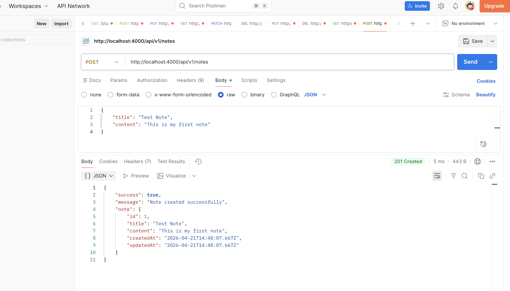
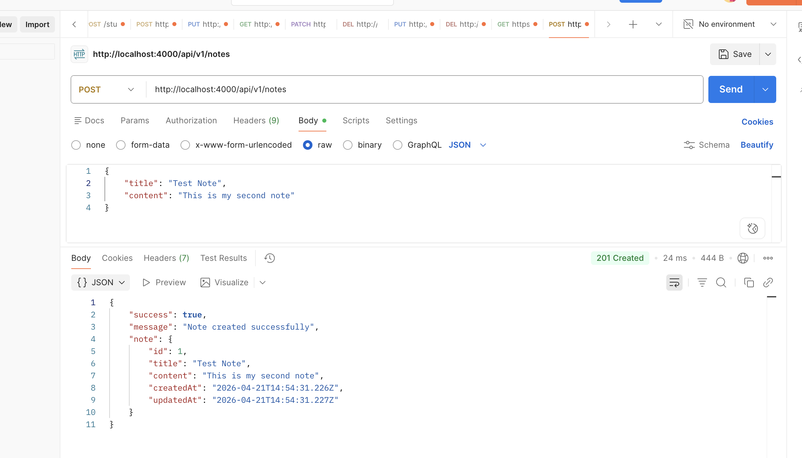
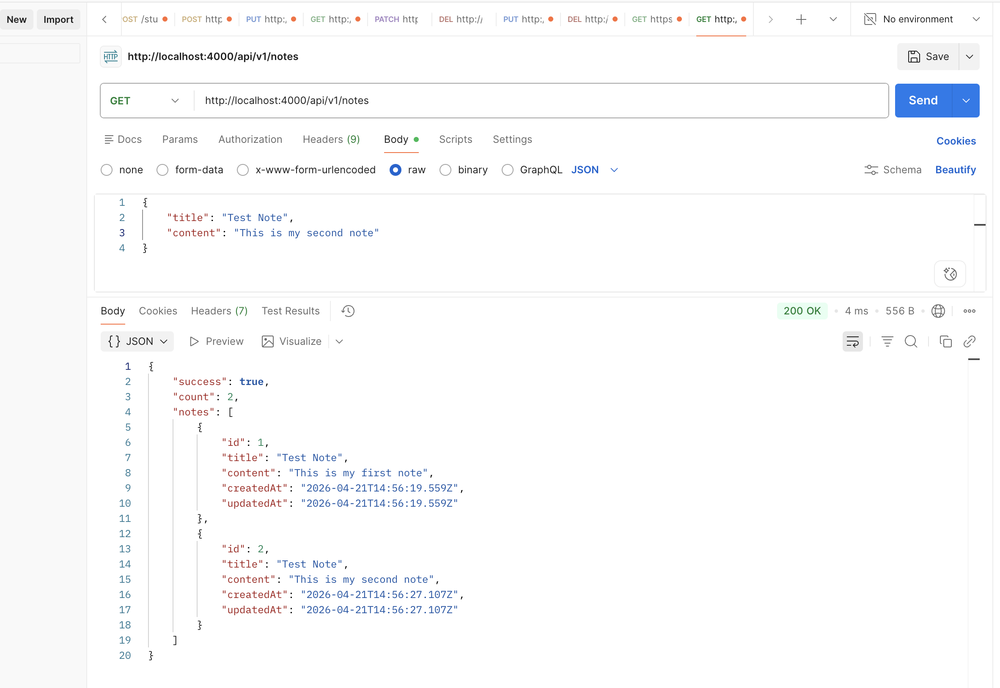
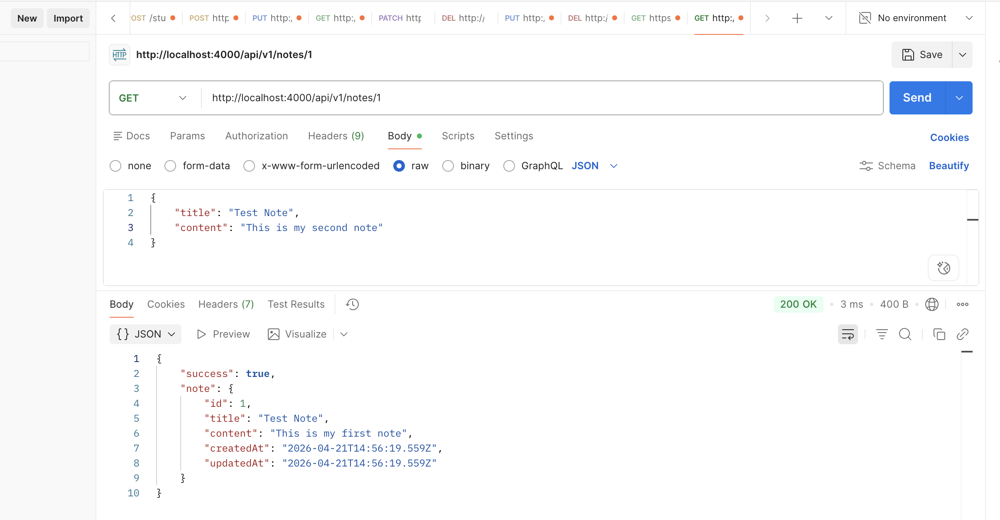
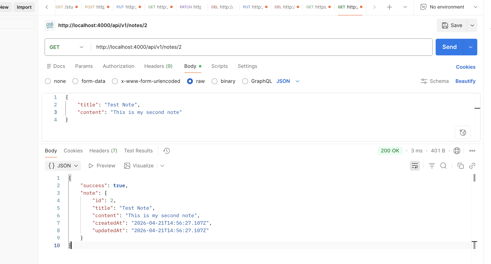
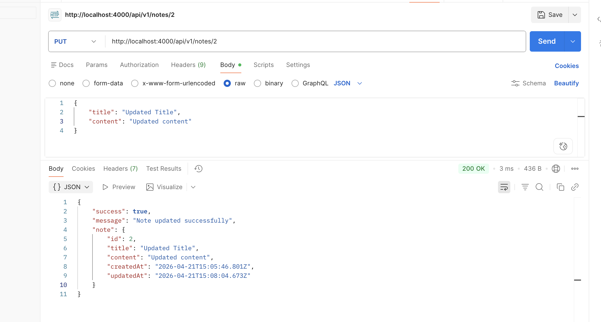
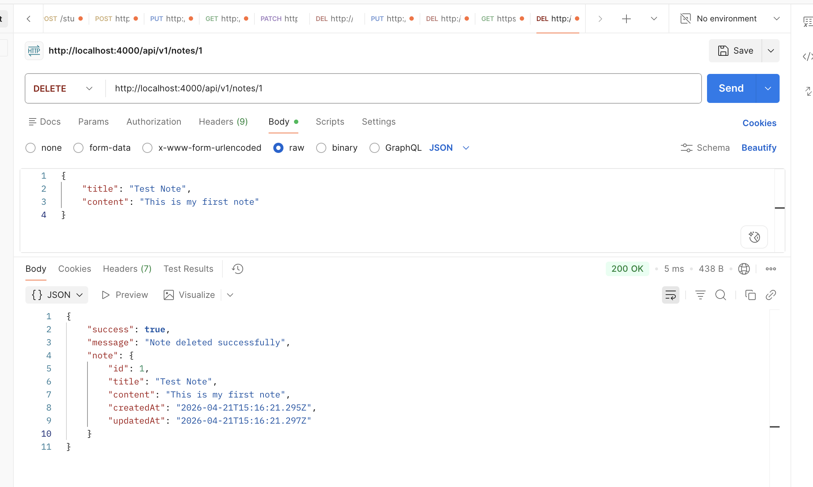
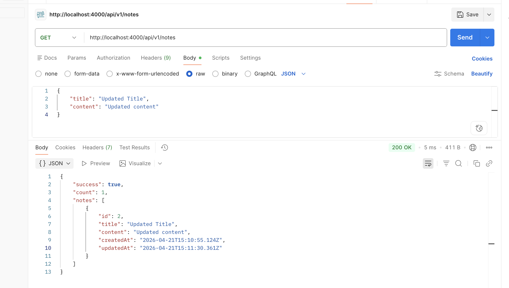
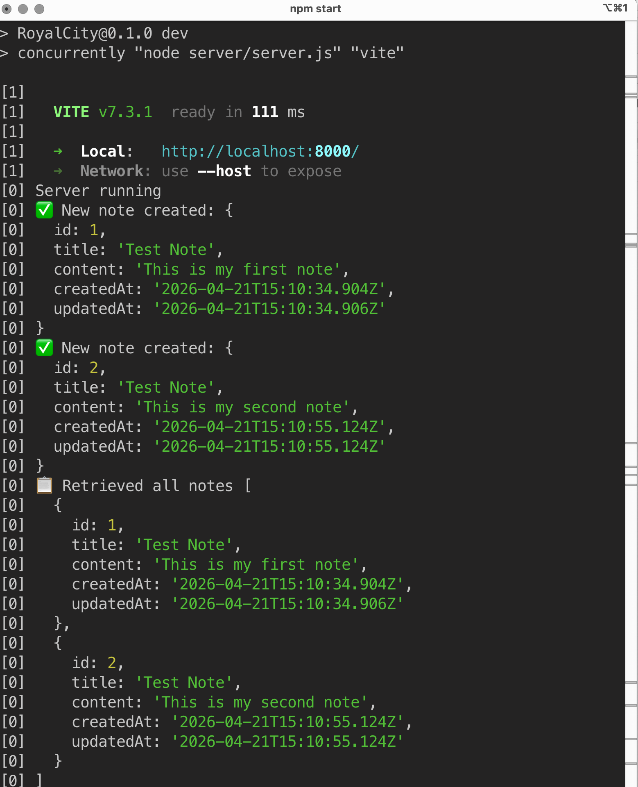
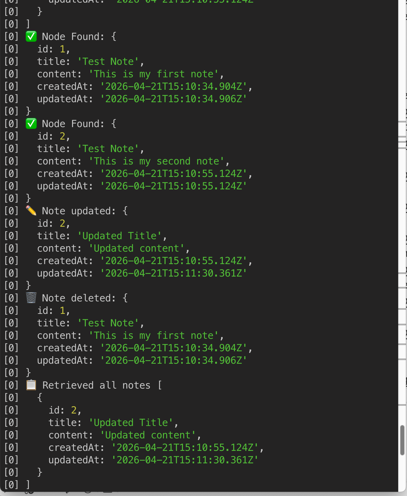

# Skill Assessment

## Run
- npm install --verbose 
- npm start

## What's added/ modified
- /server/app.js
- /server/controller/noteController.js
- /server/routes/noteRoute.js

## In-memory data structure used
``` 
// In-memory storage
let notes = [];
let nextId = 1;
```

## RESTFul API added
- POST   /api/v1/notes
- GET    /api/v1/notes
- GET    /api/v1/notes/1
- PUT    /api/v1/notes/1
- DELETE /api/v1/notes/1

## Results

### Postman
- Post the first note

- Post the second note

- Get all notes

- Get note by id 1

- Get note by id 2

- Update the second note

- Delete note 1

- Get all note again (note 2 left)


## Console 


